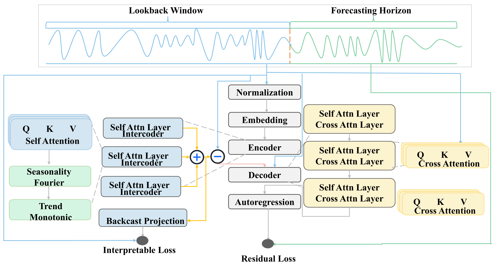

# Interformer: Interpretable Large Time Series Model For Concept Drift Adaptation

 > **Note to Reviewers (Knowledge-Based Systems):** > Welcome to the official repository for **Interformer**. Please note that while our codebase builds upon the robust LTSM pretrain-finetune pipeline initially introduced by [Timer](https://github.com/thuml/Large-Time-Series-Model), **this repository contains the novel and distinct implementation of Interformer**. Specifically, the core architectural innovations—including the **Interpretable Encoder (Intercoder)** and the **Residual-focused Cross-Attention Decoder**—are entirely original to this work and can be found in the `models/` and `layers/` directories.

## 📖 Overview

Data stream analysis faces severe challenges from **concept drift**, where the underlying data distribution shifts over time, degrading model performance. Many existing Large Time Series Models (LTSMs) lack the structural interpretability required to explicitly decouple informative drift from stochastic noise.

**Interformer** addresses this by introducing a pretrain-finetune architecture explicitly designed for interpretable stream forecasting. By leveraging the Universal Time Series Dataset (UTSD), Interformer learns universal temporal representations. 

### ✨ Key Contributions
* **Intercoder (Interpretable Encoder):** Forces the time series into a "Season-Trend-Residual" format. It uses truncated Fourier series for seasonality and polynomial functions for the trend envelope, adaptively filtering high-frequency uninterpretable noise.
* **Residual-Focused Decoder:** Forecasts the isolated residual component using cross-attention (incorporating historical residuals) and self-attention (horizon-specific residuals).
* **Robustness against Concept Drift:** Achieves consistently lower Mean Absolute Percentage Error (MAPE) across abrupt, gradual, recurrent, and sudden drift scenarios compared to state-of-the-art baselines.

---

## 🏗️ Architecture

