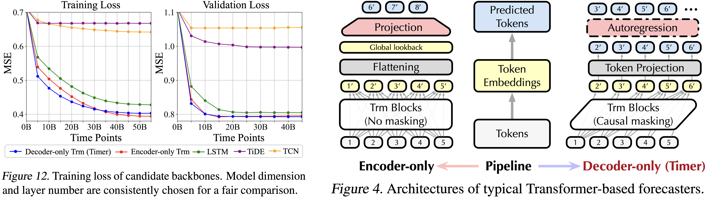

非常抱歉下载组件无法正常工作，这可能是由于当前平台的交互限制导致的。

没关系，您可以直接点击代码块右上角的“复制”按钮，然后在您的本地电脑上新建一个名为 `README.md` 的文件，将内容粘贴进去即可。

以下是完整的 `README.md` 内容：

```markdown
# Interformer: Interpretable Large Time Series Model For Concept Drift Adaptation

[](https://opensource.org/licenses/MIT)
[](https://www.python.org/downloads/)
[](#) > **🔔 Important Note to Reviewers (Knowledge-Based Systems):**
> Welcome to the official repository for **Interformer**. Please note that while our codebase builds upon the robust LTSM pretrain-finetune data pipeline initially introduced by [Timer](https://github.com/thuml/Large-Time-Series-Model) to ensure standardized pretraining on UTSD, **this repository contains the novel and distinct implementation of Interformer**. 
> 
> Specifically, the core architectural innovations—including the **Interpretable Encoder (Intercoder)** and the **Residual-Focused Cross-Attention Decoder**—are entirely original to this work. These custom modules are explicitly defined and can be found in the `models/` and `layers/` directories.

## 📖 Overview

Data stream analysis faces severe challenges from **concept drift**, where the underlying data distribution shifts over time, degrading model performance. Many existing Large Time Series Models (LTSMs) lack the structural interpretability required to explicitly decouple informative drift from stochastic noise.

**Interformer** addresses this by introducing a pretrain-finetune architecture explicitly designed for interpretable stream forecasting. By leveraging the Universal Time Series Dataset (UTSD), Interformer learns universal temporal representations and adapts them to highly non-stationary downstream tasks.

### ✨ Key Contributions
* **Intercoder (Interpretable Encoder):** Forces the time series into a strict "Season-Trend-Residual" format. It utilizes truncated Fourier series for seasonality and polynomial functions for the trend envelope, acting as a structural bottleneck to adaptively filter high-frequency uninterpretable noise.
* **Residual-Focused Decoder:** Forecasts the isolated residual component by integrating historical residuals (via cross-attention) and horizon-specific residuals (via self-attention).
* **Robustness against Concept Drift:** Achieves consistently lower Mean Absolute Percentage Error (MAPE) across abrupt, gradual, recurrent, and sudden drift scenarios compared to state-of-the-art baselines.

---

## 🏗️ Architecture

  
*(Ensure you place your Figure 1 from the paper here as `figures/architecture.png`)*

The model is trained with a dual objective: a forecasting loss (prediction MSE) and an interpretable loss (input reconstruction MSE).

---

## 🚀 Getting Started

### 1. Environment Setup

For optimal performance and dependency resolution, we recommend utilizing `micromamba` for environment management and `uv` for lightning-fast package installation.

```bash
# Create and activate the environment
micromamba create -n interformer python=3.10 -c conda-forge
micromamba activate interformer

# Install dependencies utilizing uv for rapid resolution
pip install uv
uv pip install -r requirements.txt

```

### 2. Data Preparation

To reproduce the empirical results presented in the paper, you need to acquire both the pretraining dataset and the specific downstream datasets.

* **Pretraining Data:** Download the **UTSD (Unified Time Series Dataset)** up to the 12G scale as specified in the scaling law tests. Place the data in `./data/UTSD/`.
* **Downstream Data:** Download the standard benchmarks (**ETTh2, ETTm1, WTH, ECL, TRC, DeepMIMO**) and the synthetic **CakeRotation** dataset. Place them in `./data/downstream/`.

Your project directory structure should be organized as follows:

```text
data/
├── UTSD/
│   └── ... (pretraining files)
└── downstream/
    ├── ETT-small/
    ├── weather/
    ├── electricity/
    ├── traffic/
    ├── DeepMIMO/
    └── CakeRotation/

```

---

## 💻 Usage & Reproduction

### Phase 1: Pretraining

To pretrain the Interformer on the UTSD dataset to extract universally invariant physical structures:

```bash
bash scripts/pretrain_interformer.sh

```

### Phase 2: Downstream Finetuning & Online Streaming Evaluation

To finetune the model (utilizing exactly 30% of the downstream data) and execute the strict online testing phase (batch size = 1, static forward inference):

```bash
# Example: Run evaluation on ETTh2 with a lookback window of 168 and forecast horizon of 24
bash scripts/finetune_ETTh2.sh --pred_len 24 --seq_len 168

```

*(Detailed script configurations for all other datasets and horizon lengths are available in the `scripts/` directory).*

---

## 📊 Main Results Summary

Interformer demonstrates superior zero-shot generalization and conceptual robustness on six real-world datasets, effectively reducing the average MSE by **10.44%** relative to the best competing LTSM model. Most notably, on profoundly stochastic datasets such as **DeepMIMO** and **ECL**, the Intercoder maintains exceptional structural stability where conventional online learning methods explicitly fail to converge.

---

## 🤝 Acknowledgements

We sincerely thank the authors of [Timer](https://github.com/thuml/Large-Time-Series-Model) for providing the foundational data-loading framework and UTSD curation. Their open-source contributions significantly accelerated the development of this research.

## 📝 Citation

If you find this framework or the proposed Extended Temporal Concept Drift (ETCD) formulations useful for your research, please consider citing our paper:


@article{lin2026interformer,
  title={Interformer: Interpretable Large Time Series Model For Concept Drift Adaptation},
  author={Lin, Borong and Jin, Nanlin and Zhu, Xiaohui and Grasso, Floriana},
  journal={Knowledge-Based Systems},
  year={2026},
  publisher={Elsevier}
}

